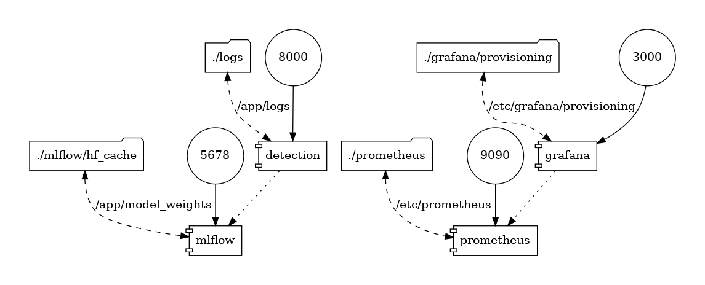

Structure:

- HuggingFace model 
  - todo: model selection argumentation.
  For more advanced model is used here, the higher the chance that an output from a higher-quality model will be recognized. For simplicity's sake, the sample input texts are generated with a [model] and jugded with the same // or a more advanced [one].
  - 
- MLFlow for model versioning
- Prometheus metrics integration for performance monitoring
- Grafana dashboards for visualizing metrics 
  - response times
  - error rate
  
    
Potentially:

- Logstash for collection of feedback
- Kibana for visualization of key aspects in logs


### Responses

#### Question 0: Authenticity of Test Text
_- Hey there! Let's kick things off by seeing how you'd figure out if this test's text is written by a person or an AI. What tools, libraries, or methods would you use to crack this?_

There are many ways to approach this question in different complexity levels. The choice should be based on the specific LLM, available computational resources, target request processing time, desired accuracy/recall level, etc. 

A simplistic approach can be based on the heuristic that AI rarely makes spelling mistakes, in other words, if there is a misspelled word, than the text was written by a human. It does not require running any models and can easily handle longer texts.

    def is_test_human_generated(test_text: str) -> bool:
        # compare tokens from input text to a vocabulary
        return any([token.strip().lower() not in vocab for test_text.split()])
    
#### Question 1: Distinguishing AI-Generated Text from Natural Text
_We're curious about your approach to determining if a text is AI-generated, especially for a Text-to-SQL task using the WikiSQL dataset. Can you write a Python function to do this? Also, how would you fit this into a larger process using LMs from Hugging Face's Model Hub?_

In this solution, I will make use of an LLM to judge about the source of the text. 
This is a more resource-heavy approach, that requires a GPU, and will take longer to classify. 
On the other hand, this is a more powerful method that can provide more accurate predictions. 
Even without training data and any task-specific finetuning, it is possible to exploit a pretrained LLM.

The solution to this question is contained in the [`./backend/models/detect.py`](detection/app/models/detect.py)

#### Question 2: Dockerized AI-Generated Text Detection Service
_Here's a cool one: can you create a service that uses your is_ai_generated function, but as a dockerized container ready for the cloud? It should have a simple REST API to return the results. If you've got the time, think about how you'd:_


_generated with this [repo](https://github.com/pmsipilot/docker-compose-viz)_

_* Scale this service in a cluster_ 

Off the top of my head, the most important aspects of scaling in this setup would be to be able to process multiple queries at the same time.
Accepting and querying multiple requests should not be too difficult, but the LLM evaluation of texts would be a bottleneck.
Probably it can be solved with multiple instances of the LLM to process requests in parallel. 

_* Sanitize the input and output_

Input could have a sanity check if they are inappropriate and should not be answered (e.g. based on a list of banned words).
I am not entirely sure if "prompt hacking" is possible through LLMs, like SQL injections? 

As for the output: since I used an LLM to make decisions, its output comes in the form of text. Although it is asked to only answer with 'yes' or 'no', it should be verified/postprocessed into binary form/re-queried.

_* Test the service thoroughly_

To be able to verify the quality of the code, I would include tests on different level of the application: testing the unit functionality, like prompt preprocessing, testing that single docker containers respond as expected, testing the entire pipeline, i.e. the interactions are working.
If the service is scaled, throughput/latency tests can be performed. 
These are the tests that ensure the functionality of the service. 

A basic template test is implemented [here](tests/test_prompt.py).

_Also, could you add a feedback endpoint? It'd be super helpful for gathering calibration data based on the model's accuracy._

Integrating a feedback endpoint is implemented [here](detection/app/routes/feedback.py). 
This logs the prompt together with the user feedback.

#### Question 3: Handling Ambiguity in Text-to-SQL
_Text-to-SQL can get tricky with ambiguous text. How about writing a Python function to sort this out, ensuring we get accurate SQL queries from the WikiSQL dataset? Plus, it'd be great if you could talk about integrating this into a larger Text-to-SQL process._

Resolving ambiguities can also be done using an LLM. However, to be able to resolve it, additional input might be neccessary.
Disambiguating a text can either be done with respect to the SQL query, such that the text reflects the query deterministically,
or "blindly" in case of an unseen text input, which can lead to the wrong query the user did not intend.

It would be possible to collect user feedback at this point, asking the user to evaluate the disambiguation step. 
Then, this data can be used for disambiguation finetuning.

def preprocess_text(text: str) -> str:
    # Your code here
    pass

#### Question 4: Improving LM Performance Over Time
Here's a challenge for you: outline a Python strategy to boost an LM's performance in Text-to-SQL tasks over time, using the WikiSQL dataset. Think monitoring, feedback loops, training... the whole nine yards. Also, how will you measure success and manage LM versions from Hugging Face's Model Hub?

From the feedback we have gathered in Question 2, we could build a custom "error" dataset to finetune the default model. 
The instances would be formatted in the same way as the prompt, to encourage the model to learn the expected custom format, 
instead of general-purpose question answering. Both positive and negative input can be included into finetuning, by adjusting the correct reponse in the reference prompt completion.

Completed prompt example:
```
Instruction: Act like a linguist. You may only use 'yes', if you think that the text provided was generated by an algorithm, e.g. language model, and 'no', if it looks like a human-written text, as your answer.
Question: Is the following sentence AI-generated?
Text: Is this generated with AI?
Response: No
```

def improve_lm_performance(model: str, dataset: str) -> None:
    # Your code here
    pass
